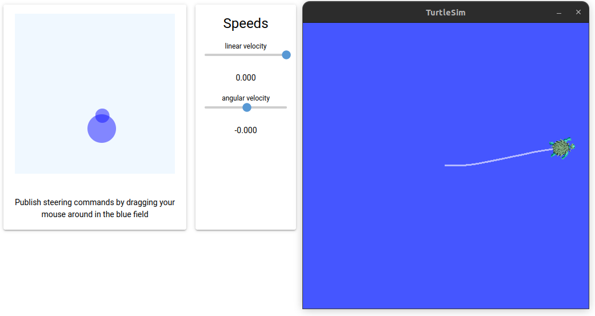

## What it does
This small programm creates a simple joystick which controls the turtlesim_node. This example fits right in with the [ros2 turtlesim tutorial](https://docs.ros.org/en/humble/Tutorials/Beginner-CLI-Tools/Introducing-Turtlesim/Introducing-Turtlesim.html).

Note: This node is not continuously sending. It will send a new twist command on change of the joystick.


## How to use

Terminal1 :
```bash
ros2 run ros_nicegui_turtlesim_joystick joystick 
```

Terminal2 :
```bash
ros2 run turtlesim turtlesim_node 
```
